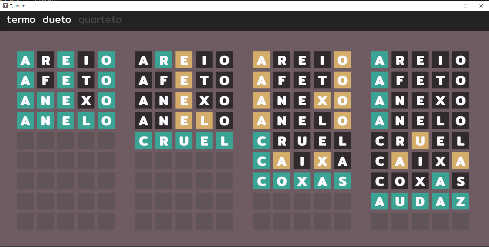

# Clone do Termo em Pygame + Integração com Resolvedor

Uma recriação jogável do jogo **Termo** feita em `Pygame`, com visual inspirado no original e um diferencial marcante: **integração com um algoritmo de resolução automática** usando lógica, filtragem e dedução inteligente.

## 🎮 Sobre o Projeto

Este projeto recria o jogo Termo com interface visual usando a biblioteca `Pygame`, mantendo a essência do jogo original e recriando todos os modos de jogo. A grande sacada está na **integração com um resolvedor automático**, que pode jogar sozinho aplicando estratégias inteligentes de dedução baseadas em feedback das letras.

## 🧠 Funcionalidades

🎮 Jogabilidade igual ao original  
📦 Customização das palavras do jogo  
🤖 Modo automático: jogo se resolve sozinho 

## 🧩 Tecnologias Utilizadas

| Ferramenta     | Finalidade                        |
|----------------|-----------------------------------|
| Python         | Linguagem principal               |
| Pygame         | Interface gráfica e eventos       |

## 🖥️ Preview

### 👨‍👩‍💻 Preview do Jogo:

